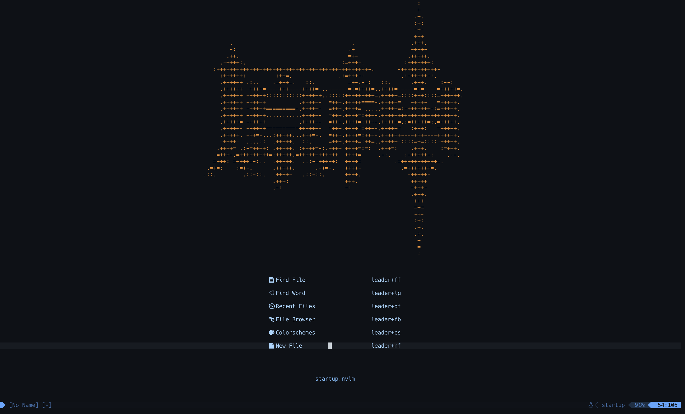
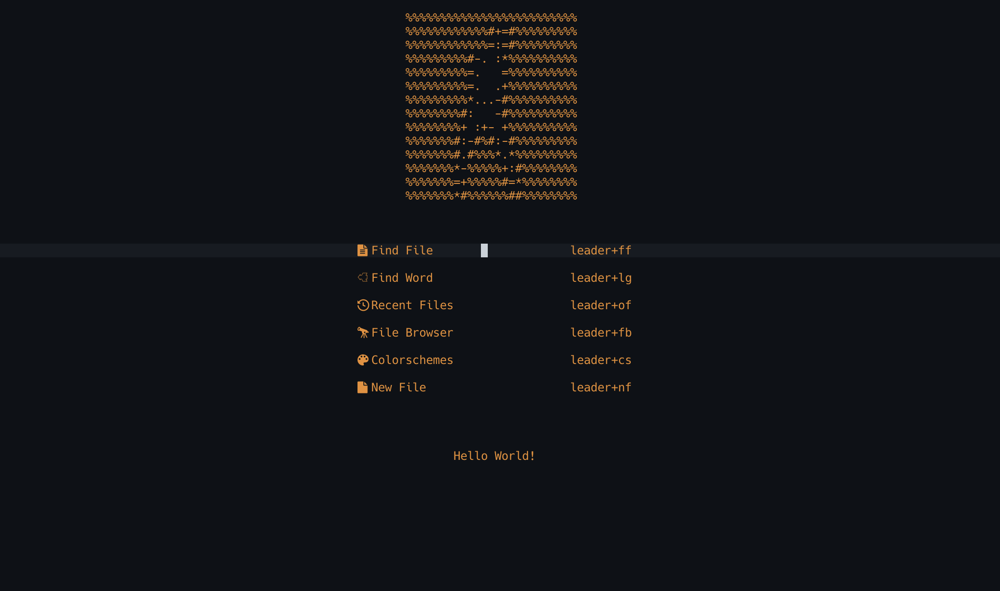

#### Intro
This respository includes my personal neovim config.

Most of my configuration is copied from [eggtoopain](https://github.com/eggtoopain/Neovim ).Thank for his tutorial. 

The dashboard:
 

